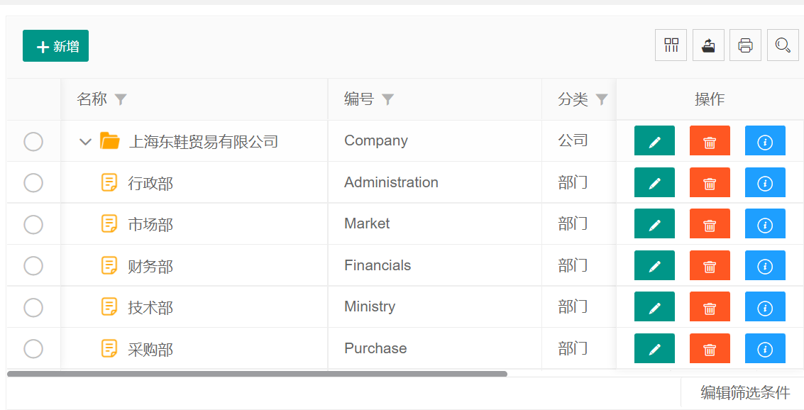

# 作者寄语
- 插件基本满足微端使用，基本可以满足微端使用，源码不复杂，可以给大家学习

# 演示地址
- http://106.75.169.226:5000/page/tableTree.html
- 用于WaterCloud框架，地址：http://106.75.169.226:5000/ 账户：admin 密码：0000 模块：组件管理-卡片表格
- WaterCloud框架，源码地址：https://gitee.com/qian_wei_hong/WaterCloud
- 前端框架文件在WaterCloud/WaterCloud.Web/wwwroot下，关键页面文件在WaterCloud/WaterCloud.Web/Views下

# 组件引用方法
         

        layui.config({
          base: '../js/layui_exts/' //配置 layui 第三方扩展组件存放的基础目录
        }).extend({
          cardTable: 'tabletree/tabletree' 
        }).use(['tabletree'], function(){

## 使用文档
- 注意，如果要使用soul-table请打开源码注释，或者联系作者

### 引入模块
下载module/treetable-lay整个文件夹，放在你的项目里面，然后使用模块加载的方式使用：
```javascript
layui.config({
    base: 'module/'
}).extend({
    treetable: 'treetable-lay/treetable'
}).use(['treetable'], function () {
    var treetable = layui.treetable;
    
});
```

### 渲染表格
```html
<table id="table1" class="layui-table" lay-filter="table1"></table>

<script>
layui.use(['treetable'], function () {
    var treetable = layui.treetable;
    
    // 渲染表格
    treetable.render({
        treeColIndex: 2,          // treetable新增参数
        treeSpid: -1,             // treetable新增参数
        treeIdName: 'd_id',       // treetable新增参数
        treePidName: 'd_pid',     // treetable新增参数
        treeDefaultClose: true,   // treetable新增参数
        treeLinkage: true,        // treetable新增参数
        elem: '#table1',
        url: 'json/data1.json',
        cols: [[
            {type: 'numbers'},
            {field: 'id', title: 'id'},
            {field: 'name', title: 'name'},
            {field: 'sex', title: 'sex'},
            {field: 'pid', title: 'pid'},
        ]]
    });
});
</script>

```

> 注意：<br>
> &emsp;&emsp;可以使用url传递数据，也可以使用data传递数据，如果使用url传递数据，参数是where字段，
> 跟layui数据表格的使用方式一致。

<br/>

**数据格式**

&emsp;总而言之就是以id、pid的形式，不是以subMenus的形式，当然id、pid这两个字段的名称可以自定义：
```json
{
  "code": 0,
  "msg": "ok",
  "data": [{
      "id": 1,
      "name": "xx",
      "sex": "male",
      "pid": -1
    },{
      "id": 2,
      "name": "xx",
      "sex": "male",
      "pid": 1
    }
  ]
}
```

### 参数说明
&emsp;layui数据表格的所有参数都可以用，除此之外treetable新增的参数有：

 参数 | 类型 | 是否必填 | 描述 |
 --- | --- | --- | ---
 treeColIndex | int | 是 | 树形图标显示在第几列
 treeSpid | object | 是 | 最上级的父级id
 treeIdName | string | 否 | id字段的名称
 treePidName | string | 否 | pid字段的名称
 treeDefaultClose | boolean | 否 | 是否默认折叠
 treeLinkage | boolean | 否 | 父级展开时是否自动展开所有子级


**treeColIndex**

树形图标（箭头和文件夹、文件的图标）显示在第几列， 索引值是cols数组的下标。

**treeSpid**

最上级的父级id，比如你可以规定pid为0或-1的是最顶级的目录。
 
**treeIdName**

treetable是以id和pid字段来渲染树形结构的，如果你的数据没有id和pid字段，你可以指定id和pid字段的名称。

**treePidName**

pid在你的数据字段中的名称。

**treeDefaultClose**

默认是全部展开的，如果需要默认全部关闭，加上treeDefaultClose:true即可。

**treeLinkage**

父级展开时是否自动展开所有子级


### 注意事项

- 不能使用分页功能，即使写了page:true，也会忽略该参数。
- 不能使用排序功能，不要开启排序功能。
- table.reload()不能实现刷新，请参考demo的刷新。
- 除了文档上写的treetable.xxx的方法之外，其他数据表格的方法都使用table.xxx。
- 建议删除和修改请求完后台之后请刷新（重新渲染）表格，最好不要使用obj.delete方式删除。

### 其他方法

**全部展开**
```javascript
treetable.expandAll('#table1');
```
 
**全部折叠**
 ```javascript
treetable.foldAll('#table1');
```

# 常见问题